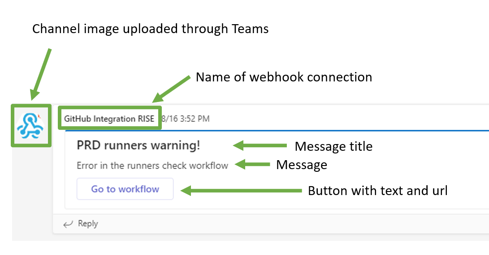

# ms-teams-notification
Internal action to send a notification to MS Teams.

Note: the runner that is used for sending the notification must be able to connect to the internet, since MS Teams is cloud hosted. If your runner has no internet connection, then the action will timeout after 5 minutes.

# Inputs

|Input|Description|Required|Default value|
|---|---|---|---|
|title|Title for the notification|Yes|None|
|text|Text for the notification|Yes|None|
|button_text|Text to display in the action button|Yes|None|
|url|Url for the action button|No|A link back to the caller workflow run|
|teams_webhook_url|Teams webhook url|Yes|None|

# Usage

``` yaml
uses: asml-gh/ms-teams-notification
with: 
  title: 'Title for the notification'
  text: 'Text for the notification'
  button_text: 'Text to display in the action button'
  url: "https://asml.com"
```

# Example result

